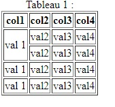

# cour 05 : **``listes et Tableaux``:**


## 1. **``Les Tableaux:``**


### a.**Définition:**

- un tableau est une structure de données qui organise l'information en lignes et colonnes. 
    
- Un tableau en HTML est créé à l'aide des balises spécifiques, principalement les balises `<table>`, `<tr>`, `<th>`, et `<td>`. 
    


### b. **Les Balises Principales pour les Tableaux en HTML:**

- **`<table>` :**
    
    - La balise `<table>` est la balise principale pour définir un tableau en HTML. Elle englobe toutes les autres balises liées au tableau.

    - **Exemple:**
        ```html
        <table>
        <!-- Contenu du tableau ici -->
        </table>
        ```

-  **`<caption>` :** 
    
    - Cette balise est utilisée pour définir un titre ou une légende pour le tableau. Elle est placée à l'intérieur de la balise `<table>` et généralement juste après l'ouverture de la balise `<table>`. Le texte inclus dans la balise `<caption>` apparaîtra au-dessus du tableau.

   - **Exemple :**
    ```html
    <table>
        <caption>Titre du Tableau</caption>
        <!-- Contenu du tableau ici -->
    </table>
    ```

- **`<thead>` :** 
    
    - Cette balise est utilisée pour regrouper les éléments d'en-tête du tableau( les noms des colonnes ). 
    
    - Elle est souvent utilisée pour contenir une ou plusieurs lignes d'en-tête (`<th>`) au sein de la balise `<thead>`.

   - **Exemple :**

    ```html
    <table>
        <thead>
            <th>En-tête 1</th>
            <th>En-tête 2</th>
        
        </thead>
        <!-- Contenu du tableau ici -->
    </table>
    ```

- **`<tbody>` :** 
    
    - Cette balise est utilisée pour regrouper les éléments de corps du tableau. 
    
    - Elle est souvent utilisée pour contenir les lignes de données (`<td>`) au sein de la balise `<tbody>`.

   Exemple :
   ```html
   <table>
     <tbody>
        <!-- ligne  -->
       <tr>
         <td>Donnée 1</td>
         <td>Donnée 2</td>
       </tr>
     </tbody>

   </table>
   ```


- **`<tr>` :** 

    - La balise `<tr>` (table row) est utilisée pour définir une ligne dans le tableau. Elle doit être contenue dans la balise `<table>`. 

    - **Exemple:**

        ```html
        <tr>
        <!-- Contenu de la ligne ici -->
        </tr>
        ```

- **`<th>` :**

    - La balise `<th>` (table header) est utilisée pour définir une cellule d'en-tête (nom du colonne ). 
    
    - Les cellules d'en-tête sont généralement utilisées pour les étiquettes de colonnes ou de lignes. 

    - **Exemple:**

        ```html
        <tr>
        <th>En-tête 1</th>
        <th>En-tête 2</th>
        </tr>
        ```

- **`<td>` :**

    - La balise `<td>` (table data) est utilisée pour définir une cellule de données dans une ligne. C'est là que vous placez les données réelles du tableau.

    - **Exemple:**

        ```html
        <tr>
        <td>Donnée 1</td>
        <td>Donnée 2</td>
        </tr>
        ```

### C.**Attributs Importants pour les Balises de Tableau:**

- **`colspan` et `rowspan` :**

    - Ces attributs sont utilisés pour fusionner des cellules horizontalement (`colspan`) ou verticalement (`rowspan`).

    - **Exemple:**

        ```html
        <td colspan="2">Cellule fusionnée</td>
        <td rowspan="2">Cellule fusionnée</td>
        ```

    - **Exemple sur `rowsapn`:**


        ```html
        <table border="1">
        <caption> Tableau 1 :</caption>
        
        <thead>
            <th> col1 </th>
            <th> col2 </th>
            <th> col3 </th>
            <th> col4 </th>
        </thead>
        
        <tbody>
            <!-- ligne 1 -->
            <tr>
                <td rowspan="2"> val 1</td>
                <td> val2 </td>
                <td> val3 </td>
                <td> val4 </td>
            </tr>

            <!-- ligne 2  -->
            <tr>
                <!-- <td> val 1</td> -->
                <td> val2 </td>
                <td> val3 </td>
                <td> val4 </td>
            </tr>            
            
            <!-- ligne 3  -->
            <tr>
                <td> val 1</td>
                <td> val2 </td>
                <td > val3 </td>
                <td> val4 </td>
            </tr>            
            
            <!-- ligne 4  -->
            <tr>
                <td> val 1</td>
                <td> val2 </td>
                <td> val3 </td>
                <td> val4 </td>
            </tr>


        </tbody>
    
        
    </table>        
    ```





- **`border` :**

    - Cet attribut définit la largeur de la bordure autour du tableau. Bien que son utilisation soit moins courante de nos jours, vous pouvez toujours le rencontrer dans des exemples plus anciens.

    - **Exemple:**
    ```html
    <table border="1">
    <!-- Contenu du tableau ici -->
    </table>
    ```


## 2. **``les Listes``:**


- Les listes en HTML sont utilisées pour organiser et structurer l'information de manière ordonnée ou non ordonnée. 

- Il existe trois types principaux de listes en HTML : les listes **non ordonnées**, **les listes ordonnées**, et **les listes de définition**. 


- **Listes Non Ordonnées:**

    - Les listes non ordonnées sont utilisées lorsque l'ordre des éléments n'a pas d'importance. 
    
    - Les éléments de la liste sont généralement affichés avec des puces.

    
    - **Balise `<ul>` (Unordered List):**

        - La balise `<ul>` est utilisée pour créer une liste non ordonnée.
        - la balise `<li>` pour inseré un élement de la liste . 
    
    - **Exemple :**
        ```html
        <ul>
        <li>Élément 1</li>
        <li>Élément 2</li>
        <li>Élément 3</li>
        </ul>
        ```

    - **Résultat :**
        - Élément 1
        - Élément 2
        - Élément 3

- **Listes Ordonnées:**
 
    - Les listes ordonnées sont utilisées lorsque l'ordre des éléments est important.
    
    - Les éléments de la liste sont généralement affichés avec des numéros ou des lettres.

    
    - **Balise `<ol>` (Ordered List):**

        - La balise `<ol>` est utilisée pour créer une liste ordonnée.

    - **Exemple :**
        ```html
        <ol>
        <li>Étape 1</li>
        <li>Étape 2</li>
        <li>Étape 3</li>
        </ol>
        ```

        Résultat :
        1. Étape 1
        2. Étape 2
        3. Étape 3

    
    - **les attributs de `<ol>`:**

        1. **Attribut `start` :**
            - L'attribut `start` permet de spécifier à partir de quel numéro la liste ordonnée doit commencer.
            - Il est utile lorsque vous souhaitez commencer la numérotation à un numéro autre que 1.

            - **Exemple :**
                ```html
                <ol start="5">
                    <li>Étape 5</li>
                    <li>Étape 6</li>
                    <li>Étape 7</li>
                </ol>
                ```

        2. **Attribut `reversed` :**

            - L'attribut `reversed` est un attribut booléen qui inverse l'ordre des numéros dans la liste ordonnée.
            - Il est souvent utilisé en conjonction avec l'attribut `start` pour créer une numérotation décroissante.

            
            - **Exemple :**
                ```html
                <ol start="3" reversed>
                    <li>Étape 3</li>
                    <li>Étape 2</li>
                    <li>Étape 1</li>
                </ol>
                ```

        3. **Attribut `type` :**

        - L'attribut `type` permet de spécifier le type de numérotation ou de marquage dans une liste ordonnée.
        - Les valeurs courantes sont "1" (numérotation par défaut), "A" (majuscules alphabétiques), "a" (minuscules alphabétiques), "I" (majuscules romaines), et "i" (minuscules romaines).

        - **Exemple :**
            ```html
            <ol type="A">
                <li>Étape A</li>
                <li>Étape B</li>
                <li>Étape C</li>
            </ol>
            ```


- **Listes de Définition:**

    - Les listes de définition sont utilisées pour associer des termes à leurs définitions.

    
    - **Balises `<dl>`, `<dt>`, et `<dd>` (Definition List, Definition Term, Definition Description):**

        - `<dl>` : Utilisée pour créer une liste de définition.
        - `<dt>` : Utilisée pour définir le terme.
        - `<dd>` : Utilisée pour définir la description associée au terme.

    - **Exemple :**

        ```html
        <dl>
        <dt>Terme 1</dt>
        <dd>Définition 1</dd>
        
        <dt>Terme 2</dt>
        <dd>Définition 2</dd>
        
        <dt>Terme 3</dt>
        <dd>Définition 3</dd>
        </dl>
        ```

    - **Résultat :**
        - Terme 1
        - Définition 1
        - Terme 2
        - Définition 2
        - Terme 3
        - Définition 3

