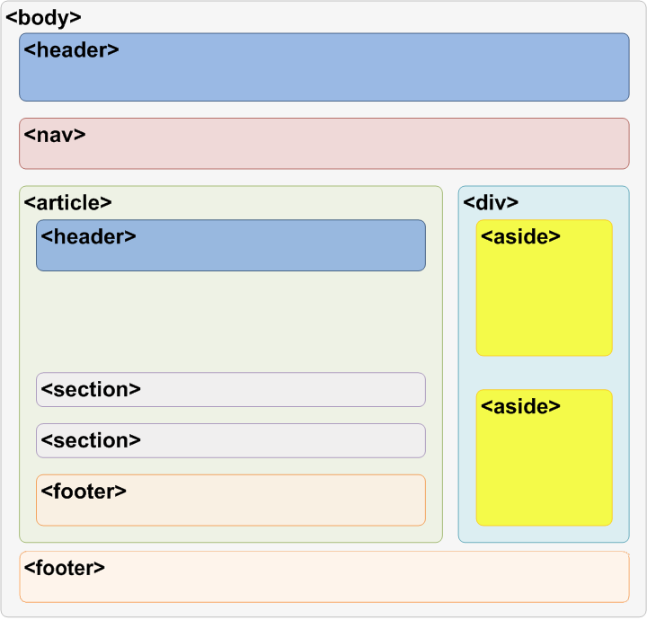

# cour : **Les Elements sémantiques**

## 1. **Introduction:**

>La sémantique en HTML se réfère à l'utilisation appropriée des balises HTML pour structurer et décrire le contenu d'une page web de manière significative et compréhensible, tant pour les navigateurs que pour les développeurs et les outils d'accessibilité. En d'autres termes, elle consiste à choisir les balises HTML en fonction de leur signification sémantique pour représenter correctement le sens du contenu.

- L'utilisation correcte de la sémantique en HTML est cruciale pour plusieurs raisons :

    1. **Compréhension du contenu :** Une structure sémantique bien définie facilite la compréhension du contenu d'une page par les moteurs de recherche, les navigateurs, les lecteurs d'écran et autres technologies d'assistance.

    2. **Accessibilité :** En utilisant des balises HTML sémantiques, on améliore l'accessibilité de la page pour les personnes ayant des handicaps, en particulier pour celles qui dépendent des lecteurs d'écran.

    3. **SEO (Optimisation pour les moteurs de recherche) :** Les moteurs de recherche utilisent la structure sémantique d'une page pour mieux comprendre son contenu, ce qui peut influencer le classement dans les résultats de recherche.

    4. **Maintenabilité du code :** Une structure sémantique bien définie rend le code HTML plus lisible, compréhensible et facile à maintenir pour les développeurs.

Quelques exemples de balises HTML sémantiques incluent `<header>`, `<nav>`, `<main>`, `<article>`, `<section>`, `<aside>`, `<footer>`, `<h1>` à `<h6>`, etc. Ces balises permettent de décrire clairement la structure hiérarchique d'une page web, indiquant les en-têtes, le contenu principal, les sections, les articles, les barres de navigation, les pieds de page, etc.

En résumé, la sémantique en HTML vise à créer une structure de page web qui communique clairement le sens et la hiérarchie du contenu, améliorant ainsi l'expérience pour les utilisateurs et facilitant l'interprétation par les machines.


## 2. **la structure d'une page web:**




1. **`<header>` (élément en bloc) :**
   - **Description :** `<header>` représente l'en-tête d'une section ou d'une page. Il peut contenir des éléments tels que les titres, logos, menus de navigation, etc.
   - **Utilisation :** Marquer la partie supérieure d'une page ou d'une section.
   - **Exemple :**
     ```html
     <header>
         <h1>Mon Site Web</h1>
         <nav>
             <ul>
                 <li><a href="#">Accueil</a></li>
                 <li><a href="#">À propos</a></li>
                 <li><a href="#">Contact</a></li>
             </ul>
         </nav>
     </header>
     ```

2. **`<nav>` (élément en bloc) :**
   - **Description :** `<nav>` représente une section de navigation, souvent contenant des liens ou des menus de navigation.
   - **Utilisation :** Marquer une section contenant des liens de navigation.
   - **Exemple :**
     ```html
     <nav>
         <ul>
             <li><a href="#">Accueil</a></li>
             <li><a href="#">À propos</a></li>
             <li><a href="#">Contact</a></li>
         </ul>
     </nav>
     ```

3. **`<main>` (élément en bloc) :**
   - **Description :** `<main>` représente le contenu principal d'une page.
   - **Utilisation :** Marquer la section principale du contenu.
   - **Exemple :**
     ```html
     <main>
         <h2>Contenu principal</h2>
         <article>
             <h3>Article 1</h3>
             <p>Contenu de l'article...</p>
         </article>
         <article>
             <h3>Article 2</h3>
             <p>Contenu de l'article...</p>
         </article>
     </main>
     ```

4. **`<article>` (élément en bloc) :**
   - **Description :** `<article>` représente un contenu indépendant qui pourrait être réutilisé ou syndiqué, comme un article de blog.
   - **Utilisation :** Marquer des sections autonomes de contenu.
   - **Exemple :**
     ```html
     <article>
         <h2>Titre de l'article</h2>
         <p>Contenu de l'article...</p>
     </article>
     ```

5. **`<aside>` (élément en bloc) :**
   - **Description :** `<aside>` représente le contenu auxiliaire ou complémentaire, souvent placé à côté du contenu principal.
   - **Utilisation :** Marquer une section contenant des informations connexes mais non essentielles.
   - **Exemple :**
     ```html
     <aside>
         <h2>À propos de l'auteur</h2>
         <p>Informations supplémentaires sur l'auteur...</p>
     </aside>
     ```

6. **`<section>` (élément en bloc) :**
   - **Description :** `<section>` représente une section générique dans un document.
   - **Utilisation :** Marquer une section thématique du contenu.
   - **Exemple :**
     ```html
     <section>
         <h2>Section 1</h2>
         <p>Contenu de la section...</p>
     </section>
     ```

7. **`<footer>` (élément en bloc) :**
   - **Description :** `<footer>` représente le pied de page d'une section ou d'une page, souvent contenant des informations de copyright, des liens vers des pages associées, etc.
   - **Utilisation :** Marquer la partie inférieure d'une page ou d'une section.
   - **Exemple :**
     ```html
     <footer>
         <p>&copy; 2024 Mon Site Web. Tous droits réservés.</p>
         <nav>
             <ul>
                 <li><a href="#">Politique de confidentialité</a></li>
                 <li><a href="#">Conditions d'utilisation</a></li>
             </ul>
         </nav>
     </footer>
     ```

En utilisant ces éléments sémantiques, vous pouvez créer une structure HTML plus significative et compréhensible, améliorant ainsi l'accessibilité, l'indexation par les moteurs de recherche et la maintenance du code.


- **Exemple :**

voici un exemple global d'une page HTML qui utilise tous les éléments sémantiques que vous avez mentionnés (`<header>`, `<nav>`, `<main>`, `<article>`, `<aside>`, `<section>`, `<footer>`) pour créer une structure cohérente :

```html
<!DOCTYPE html>
<html lang="fr">
<head>
    <meta charset="UTF-8">
    <meta name="viewport" content="width=device-width, initial-scale=1.0">
    <title>Exemple de Page Web Sémantique</title>
    <style>
        body {
            font-family: Arial, sans-serif;
            margin: 20px;
        }
        header, nav, main, article, aside, section, footer {
            margin-bottom: 20px;
            border: 1px solid #ccc;
            padding: 10px;
        }
        nav ul {
            list-style-type: none;
            padding: 0;
            margin: 0;
        }
        nav ul li {
            display: inline;
            margin-right: 10px;
        }
    </style>
</head>
<body>

<!-- Header -->
<header>
    <h1>Mon Site Web</h1>
    <nav>
        <ul>
            <li><a href="#">Accueil</a></li>
            <li><a href="#">À propos</a></li>
            <li><a href="#">Contact</a></li>
        </ul>
    </nav>
</header>

<!-- Main Content -->
<main>
    <section>
        <h2>Section 1</h2>
        <p>Contenu de la section...</p>
    </section>

    <article>
        <h2>Titre de l'article</h2>
        <p>Contenu de l'article...</p>
    </article>

    <article>
        <h2>Autre article</h2>
        <p>Contenu de l'autre article...</p>
    </article>

    <aside>
        <h2>À propos de l'auteur</h2>
        <p>Informations supplémentaires sur l'auteur...</p>
    </aside>
</main>

<!-- Footer -->
<footer>
    <p>&copy; 2024 Mon Site Web. Tous droits réservés.</p>
    <nav>
        <ul>
            <li><a href="#">Politique de confidentialité</a></li>
            <li><a href="#">Conditions d'utilisation</a></li>
        </ul>
    </nav>
</footer>

</body>
</html>
```

Cet exemple illustre comment organiser une page web en utilisant les éléments sémantiques pour définir clairement différentes sections de la page. 


### RQ : la différence entre ``div`` , ``section`` , ``article`` : 

- `<section>` est utilisé pour représenter une section thématique dans un document, regroupant un contenu lié.
- `<div>` est un élément générique de division utilisé pour créer des conteneurs sans implication sémantique particulière, souvent utilisé pour le style CSS.
- `<article>` est utilisé pour représenter un contenu indépendant et autonome, tel qu'un article, pouvant être réutilisé .

## 3. **L'élément `<time>`:**

>L'élément `<time>` en HTML est utilisé pour représenter des informations temporelles ou des dates. Il permet de marquer une portion de texte dans votre document comme une date, une heure ou une combinaison de date et d'heure, et cela peut être utile pour les moteurs de recherche, les navigateurs, les lecteurs d'écran et d'autres outils qui interprètent la page.

- **Voici un exemple d'utilisation de l'élément `<time>` :**

    ```html
    <p>La date limite de soumission est <time datetime="2024-02-28">28 février 2024</time>.</p>
    ```

    Dans cet exemple, la date est affichée normalement pour les utilisateurs, mais la valeur `datetime` est fournie dans le format ISO 8601 ("AAAA-MM-JJ") pour indiquer la date de manière machine-readable. Cette information peut être utilisée par les navigateurs, les moteurs de recherche ou les lecteurs d'écran pour interpréter la date de manière plus précise.

- L'élément `<time>` peut également inclure une heure :

```html
<p>Réunion à <time datetime="2024-02-28T15:00">15h00 le 28 février 2024</time>.</p>
```

Il est important de noter que l'élément `<time>` n'a pas de style par défaut et doit être stylé via CSS si nécessaire pour s'assurer qu'il s'intègre correctement dans la conception de votre site.